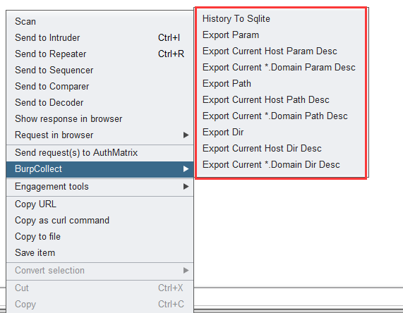

# BurpCollect

基于[BurpCollector](https://github.com/TEag1e/BurpCollector)的二次开发， 记录Burpsuite Site Map记录的里的数据包中的目录路径参数名信息，并存入Sqlite，并可导出txt文件。

# 细节

在原功能的基础上进行如下修改，其他内容见原项目[BurpCollector](https://github.com/TEag1e/BurpCollector)：

1. 将Site map内容直接存入Sqlite数据库。
2. 删除原sql语句中的count字段，采用group by 进行统计。
3. 增加部分按钮（导出所有数据，导出当前Host的对应数据，导出当前根域名的对应数据），便于导出数据到txt,见下图：
    

# Thanks

* [BurpCollector](https://github.com/TEag1e/BurpCollector)
